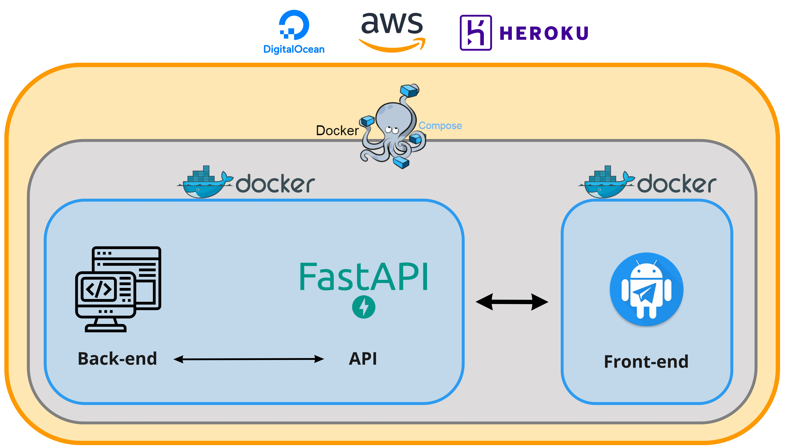

# Audio Cloud Service (ACS)

This repository is a template for any audio service running in a cloud environment. The end-to-end deploy depens on 6 steps.

---

### **1. Definition of audio service (back-end)**

The starting point in this type of integral project is to have a functional and debugged audio software, so that all the deployment around this initial audio software makes sense.

### **2. Audio service integration into an API**
Without the need to define a front-end, the audio application must be embedded in an API (Application Programming Interface). To do this, it is necessary to modularize the audio software, as each functionality will be an endpoint of our API. This step is completed when the entire audio service can be properly executed using the API endpoints.

### **3. Design of the front-end**
Here is where you should analyze the functionalities of each front-end, and choose which one is the most suitable for your application. Examples include a web application, an interactive dashboard or an integration into a messaging service, such as a bot in Telegram. In this template, a Telegram bot is used as example.

### **4. Interaction between back-end and front-end via API.**
This step is where we connect the necessary API endpoints with each front-end component. Once this is done, our service is ready to be packaged and deployed in a cloud environment.

### **5. Conteinerization with Docker**
Up to the previous step, although one may think that the product is finished, it is still difficult to migrate to other environments, and much less is it a product that can be delivered without having dependencies with the operating system where it is executed, the programming language version, the libraries, etc. To solve this, Docker containers are used to package the service, which allows an easy deploy in any cloud environment.

### **6. Deployment in a cloud server**
Once the service is packaged in a Docker continer, the deploy as simple as run our containers int the cloud environment and thats it!